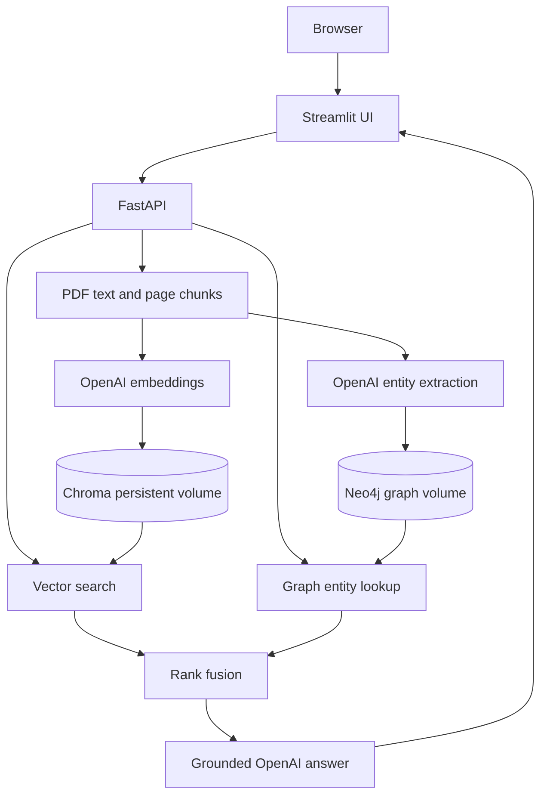

# Atlas Hybrid RAG

A document question-answering app based on the supplied **Hybrid RAG System with Vector Database and Knowledge Graph** architecture and dark dashboard reference screens. Streamlit handles uploads, chat, and document listings; FastAPI ingests PDF, DOCX, TXT, and Markdown text, stores OpenAI embeddings in persistent Chroma, extracts document concepts into Neo4j, searches both stores, and asks an OpenAI model to answer with source citations.

## Start on Windows with Docker Desktop

1. Install and open Docker Desktop; wait until its engine is running. Allocate at least 4 GB of memory to Docker.
2. Extract this ZIP. Open PowerShell in the extracted `hybrid-rag` folder (the folder containing `docker-compose.yml`).
3. Copy configuration: `Copy-Item .env.example .env`
4. Edit `.env`. Replace `OPENAI_API_KEY` with your **API platform** key, and `NEO4J_PASSWORD` with a long password. API use is billed separately from ChatGPT subscriptions. Keep `.env` private.
5. Run `docker compose up --build -d`. First build downloads images and Python packages.
6. Run `docker compose ps`. Allow Neo4j to become healthy, then open **http://localhost:8501**. API docs: **http://localhost:8000/docs**. Optional Neo4j Browser: **http://localhost:7474**, user `neo4j`, password from `.env`.
7. Upload one or more PDF, DOCX, TXT, or Markdown files (up to five per upload, 20 MB each) and click **Index documents**. In Chat, search **All indexed documents** or **Choose documents**, then ask a specific question. Expand **Sources used in this answer** to inspect the cited passages. Browse the **Documents** and **Knowledge Graph** tabs.

To apply interface changes to an existing installation, copy the updated frontend folder and run `docker compose up --build -d frontend`. To apply new format support and document listing, also update the backend folder and rebuild both: `docker compose up --build -d`. Docker volumes retain indexed data.

### Updating an existing installation

Extract this ZIP to a separate folder. Copy its `backend` and `frontend` folders into your current project and allow file replacement. Copy `docker-compose.yml` only if your existing Compose file is the one shipped with this project; preserve any local port or deployment changes. Keep your existing `.env` file and do not copy one from another machine. In the current project folder run `docker compose up --build -d`, then refresh the browser with Ctrl+F5. Avoid `docker compose down -v`, which removes saved indexes.

PowerShell health check: `Invoke-RestMethod http://localhost:8000/health`. If it fails, inspect `docker compose logs --tail=100 backend neo4j`. Stop services with `docker compose down`; saved indexes remain in volumes. `docker compose down -v` **deletes** both saved databases.

## Publish on a Hostinger Ubuntu VPS with one domain

These instructions assume you own a domain, have a Hostinger Ubuntu VPS with SSH access, and can install Docker. Use a subdomain such as `rag.example.com` if your main domain already hosts a website. Use the bare domain (`example.com`) if you want the app at the main address. Replace every example domain and IP below with yours. The VPS deployment file is **`docker-compose.vps.yml`**; the normal `docker-compose.yml` is for local development.

1. In Hostinger hPanel, open **VPS → Manage** and copy the VPS IPv4 address and SSH login details. In **Domains → Domain portfolio → Manage → DNS / Nameservers → DNS records**, add an **A** record: **Name** `rag` (or `@` for the bare domain), **Points to** your VPS IPv4 address, **TTL** default. If a conflicting A, AAAA, or CNAME record already exists for *that exact host*, fix or remove that record. If another company manages your domain's nameservers, make this change there instead. Leave your email-related DNS records alone.
2. On the VPS, enable inbound TCP ports **22** (or your custom SSH port), **80**, and **443** in **VPS → Security → Firewall**. Keep Docker's database and app ports private; the VPS Compose file only publishes 80/443.
3. On Windows, download `Hybrid_RAG_Project.zip` and open **PowerShell**. Replace the path and IP in these commands:

   ```powershell
   $zip = "$env:USERPROFILE\Downloads\Hybrid_RAG_Project.zip"
   scp $zip root@YOUR_VPS_IP:/tmp/Hybrid_RAG_Project.zip
   ssh root@YOUR_VPS_IP
   ```

   If Hostinger supplies a different username or SSH port, use that username and add `-P PORT` to `scp` and `-p PORT` to `ssh`.
4. The next commands run in the **VPS SSH terminal**, not PowerShell. If `docker compose version` does not work, install Docker Engine and its Compose plugin using the [official Ubuntu installation guide](https://docs.docker.com/engine/install/ubuntu/). Then run:

   ```bash
   sudo apt update
   sudo apt install -y unzip
   sudo unzip /tmp/Hybrid_RAG_Project.zip -d /opt
   cd /opt/hybrid-rag
   docker compose version
   cp .env.example .env
   nano .env
   ```

   In `nano`, set a real `OPENAI_API_KEY`, a long unique `NEO4J_PASSWORD`, `RAG_DOMAIN=rag.example.com` (or your bare domain), and your chosen `RAG_USER`. For the login password hash, save and exit nano (`Ctrl+O`, Enter, `Ctrl+X`), then run:

   ```bash
   read -rsp 'Website login password: ' WEB_PASS; echo
   printf '%s' "$WEB_PASS" | docker run --rm -i caddy:2-alpine caddy hash-password
   unset WEB_PASS
   nano .env
   ```

   Paste the hash shown by Caddy into `RAG_PASSWORD_HASH='...'`, retaining the **single quotes**. The hash is *not* your login password: remember the password you entered at the prompt. Save and exit. Keep `.env` private and do not commit or share it.
5. Check the A record from PowerShell with `Resolve-DnsName rag.example.com -Type A` (substitute your domain). It should show the VPS IP. On the VPS, launch the project:

   ```bash
   cd /opt/hybrid-rag
   docker compose -f docker-compose.vps.yml config --quiet
   docker compose -f docker-compose.vps.yml up --build -d
   docker compose -f docker-compose.vps.yml ps
   docker compose -f docker-compose.vps.yml logs --tail=80 caddy backend
   ```

   Open **`https://rag.example.com`** in a browser, sign in using `RAG_USER` and the website login password, then upload a test document and ask a question. Caddy provisions HTTPS automatically after DNS points to the VPS and ports 80/443 are reachable. The first build and certificate request can take several minutes.
6. To deploy a later version, back up your VPS `.env` and volumes, upload the new ZIP, extract it over `/opt`, then rerun `docker compose -f docker-compose.vps.yml up --build -d` from `/opt/hybrid-rag`. Keep your existing `.env`; do **not** run `docker compose down -v` because it deletes indexed data. Inspect errors with `docker compose -f docker-compose.vps.yml logs --tail=100 caddy frontend backend neo4j`.

If HTTPS fails, check the A record, your VPS firewall rules, whether another web server is using ports 80/443 (`sudo ss -ltnp | grep -E ':80 |:443 '`), and Caddy logs. If the page loads but the app cannot answer, check the OpenAI API key and backend logs. Use a VPS with enough RAM for Neo4j and the other containers; allow at least 4 GB as a starting point.

## Architecture



Each chunk stores the original PDF filename and page in Chroma. Neo4j holds `Document → Chunk → Entity` links and extracted `Entity → Entity` relationships. Retrieval matches vector similarity and question entities; reciprocal rank fusion selects up to six passages. The API and Chat show source badges such as `[S1]`; Chat expands the exact cited passages for verification. Rank scores are fusion scores, **not** calibrated probabilities.

The sidebar Knowledge Base uses **live Neo4j counts**: documents, graph chunks, unique entities mentioned by those chunks, and all three graph link types. The Knowledge Graph tab shows the exact link breakdown, searchable entity names, document-to-chunk links, chunk-to-entity mentions, and source-backed concept pairs in pages of 50 records. These are actual stored records, so the values will depend on your uploaded documents and can differ from design mockups. Concept links are generic `RELATED_TO` connections; no more specific predicate or numeric confidence is claimed.

Answers get a second evidence-checking model pass that removes unsupported claims. A third call is used only if citation markers need repair. AI answers cannot be guaranteed 100% accurate; inspect the cited passages for important decisions. Reupload previously indexed files to preserve headings and bullet boundaries in the new index.

## API

- `GET /health` reports backend readiness and indexed passage count.
- `GET /documents` lists indexed documents, source page counts where available, and passage counts.
- `POST /documents` accepts multipart `files` (1–5 PDF, DOCX, TXT, or Markdown files); returns document ID, filename, page count for PDFs, and chunk count.
- `POST /ask` accepts `{"question":"..."}` for all documents or `{"question":"...","document_ids":["<id>"]}` for selected documents and returns answer, cited sources, retrieval counts, elapsed time.
- `GET /knowledge-graph/summary` returns live document, chunk, entity, and per-type link counts.
- `GET /knowledge-graph/entities`, `/knowledge-graph/relationships`, and `/knowledge-graph/links?kind=document_chunks|mentions` return searchable records with `offset` and `limit` pagination.

## Limits and operating notes

- Scanned PDFs require OCR first. PDF extraction may be imperfect on complex tables or multi-column pages. DOCX files yield paragraphs and tables; TXT and Markdown must be UTF-8.
- The project needs a working internet connection to the OpenAI API and paid API credits. Key, model access, Docker images, and local network availability must be provided by you; they cannot be validated in a packaged ZIP.
- Maximum 100 pages and 150 chunks per PDF by default. Very large collections need asynchronous ingestion, batch graph writes, access controls, pagination, and external storage.
- Uploaded PDF bytes are processed in memory and are **not** retained; extracted text and embeddings persist in Docker volumes. Do not upload confidential material unless your use of OpenAI and your deployment policy permit it.
- To remove a document, delete its indexes through a future admin endpoint or reset both volumes; this starter does not expose deletion. Reupload of the exact same PDF refreshes the same document ID.
- The VPS Compose file places the UI behind HTTPS and one shared website login. It has no separate user accounts or per-user document isolation; use a unique password and share it only with trusted users.

## Development checks

With Python 3.11: `python -m pip install -r backend/requirements.txt pytest` and `python -m pytest -q` from the project folder. Integration needs a live OpenAI key, Docker, and reachable Neo4j.
