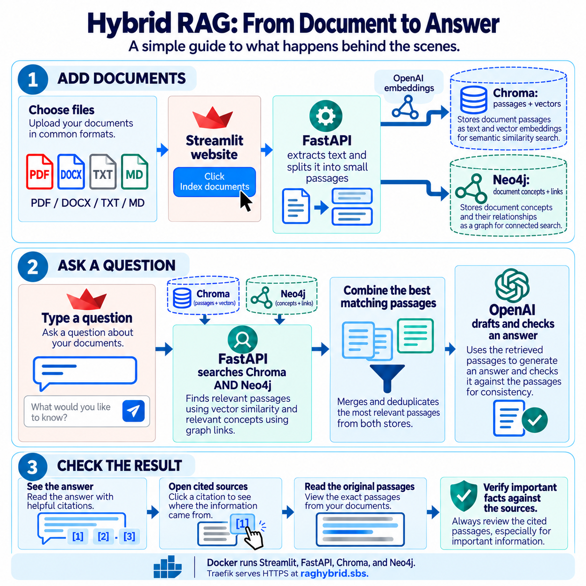

# Hybrid RAG — ask questions about your documents

Upload a PDF, Word, text, or Markdown file. Ask a question in everyday language. The app finds passages and shows sources alongside its answer so you can check the original text.

**Website:** https://raghybrid.sbs · **Repository:** https://github.com/sarathkumar-as/Hybrid_RAG

> AI answers can be wrong. Check the cited passage. Scanned PDFs need OCR before upload. The public website has no separate user accounts.

## Use the app

1. Open the website or start the project locally using the steps below.
2. In the left sidebar, choose up to five files and click **Index documents**. Selecting a file alone does not save it.
3. Wait for indexing to finish. **Latest indexing run** starts at zero per browser session and updates after a successful upload. **Knowledge Graph** shows saved totals across sessions.
4. In **Chat**, ask a specific question. Optionally select which documents to search.
5. Expand **Sources used in this answer** and check the passages yourself.
   While searching, the question and an animated Read → Retrieve → Verify → Answer graphic appear. If an answer cannot be verified, the app displays the closest indexed passages as quotations instead of inventing a claim.
6. In **Documents**, open extracted text or delete an index. Deletion requires a separate administrator secret; ordinary visitors can browse and ask without a password.

## Architecture



| Stage | Component | Result |
| --- | --- | --- |
| Upload | Streamlit → FastAPI | Sends PDF, DOCX, TXT, or Markdown |
| Prepare | Backend | Extracts text and makes passages, retaining PDF page numbers |
| Index | OpenAI + Chroma | Embeds passages and stores their vectors |
| Connect | OpenAI + Neo4j | Extracts concepts and saves document/passage/concept links |
| Retrieve | Chroma + Neo4j | Finds vector and concept matches and combines rankings |
| Answer | OpenAI + Streamlit | Drafts and reviews an answer and displays cited passages |

[Editable diagram](docs/architecture.mmd). Citations identify the passage used; they do not guarantee a claim is true. Docker volumes retain indexed data after container restarts.

## Project files

| Path | Purpose |
| --- | --- |
| `frontend/app.py` | Upload, chat, documents, graph browser |
| `backend/main.py` | FastAPI routes and validation |
| `backend/service.py` | Indexing, retrieval, answer review, deletion |
| `backend/core.py` | Extraction, chunking, ranking, citation checks |
| `tests/`, `.github/workflows/checks.yml` | Focused checks and automatic GitHub test run |
| `docker-compose.yml` | Local development |
| `docker-compose.traefik.yml` | Existing Traefik VPS deployment |
| `docker-compose.vps.yml`, `deploy/Caddyfile` | Alternative VPS setup when ports 80/443 are free |
| `.env.example` | Configuration template; copy to private `.env` |

## Start locally in VS Code (Windows)

You need Docker Desktop, VS Code, and a valid OpenAI API key. API use is billed separately from a ChatGPT subscription.

1. In VS Code, open the folder containing `docker-compose.yml`.
2. Start Docker Desktop. Open **Terminal → New Terminal**; these commands run in **PowerShell on your computer**.
3. If `.env` is missing, run `Copy-Item .env.example .env`. Keep an existing `.env` unchanged.
4. Edit `.env`. Set `OPENAI_API_KEY` and a strong `NEO4J_PASSWORD`. Set a separate long `ADMIN_DELETE_TOKEN` if you want to use Delete. Keep `.env` private.
5. Run `docker compose up -d --build` and then `docker compose ps`. Wait until Neo4j is healthy.
6. Open http://localhost:8501. Index a small test file, ask a question, and inspect its cited passage.

For errors run `docker compose logs --tail=100 backend frontend neo4j`. Stop with `docker compose down`. **Do not run `down -v` during an update**: it removes saved databases.

## Upload updates to GitHub

In the **existing** project folder in VS Code PowerShell, after copying updated files into it:

```powershell
git status
git add README.md QUALITY_CHECK.md .github backend frontend tests docs .env.example docker-compose.traefik.yml
git diff --cached --name-only
git commit -m "Improve evidence checks and project guide"
git pull --rebase origin main
git push origin main
```

Check staged names before committing. Never upload `.env`, API keys, private documents, or data volumes. Resolve reported merge conflicts before pushing. Do not force push.

## Deploy updates to the existing Hostinger VPS

The current website uses Traefik for HTTPS and has no website login. The deletion secret remains private. The VPS also runs other services: keep its existing proxy setup, `.env`, and Docker volumes.

1. Push updated code to GitHub and check that the files appear there.
2. Open the **Hostinger VPS terminal** (the following commands run there, not in Windows PowerShell). The prepared deployment checkout is `/opt/hybrid-rag-next`; `/opt/hybrid-rag` is an older copy.
3. Run `git -C /opt/hybrid-rag-next status --short` and `git -C /opt/hybrid-rag-next fetch origin`. If the checkout is clean, run `git -C /opt/hybrid-rag-next checkout --detach origin/main`. Compare its commit with the one just pushed from VS Code.
4. Put a long `ADMIN_DELETE_TOKEN` in the VPS's private `.env` if you need administrator deletion. Never paste the token into GitHub or a screenshot.
5. Validate and rebuild the app:

```bash
docker compose -p hybrid-rag --env-file /opt/hybrid-rag-next/.env -f /opt/hybrid-rag-next/docker-compose.traefik.yml config --quiet
docker compose -p hybrid-rag --env-file /opt/hybrid-rag-next/.env -f /opt/hybrid-rag-next/docker-compose.traefik.yml up -d --build backend frontend
docker compose -p hybrid-rag --env-file /opt/hybrid-rag-next/.env -f /opt/hybrid-rag-next/docker-compose.traefik.yml ps
```

6. Refresh https://raghybrid.sbs. Index a **test** document and verify an answer against its source. For errors, run `docker logs --tail 100 hybrid-rag-backend-1` and `docker logs --tail 100 hybrid-rag-frontend-1`.

The checked-in Traefik configuration must be checked against the VPS's actual network before deployment. An archive does not deploy itself to the live website.

## API and limits

| Endpoint | Purpose |
| --- | --- |
| `GET /health` | Readiness and indexed passage count |
| `POST /documents`, `GET /documents` | Index and list documents |
| `GET /documents/{id}/passages` | Show extracted text, not the original file |
| `DELETE /documents/{id}`, `DELETE /documents` | Remove indexes; require `X-Delete-Token` matching private `ADMIN_DELETE_TOKEN` |
| `POST /ask` | Cited answer and retrieval details |
| `GET /knowledge-graph/summary`, `/entities`, `/relationships`, `/links` | Explore graph records |

Default limits: five files per request, 20 MB per file, 100 PDF pages, 150 passages per file. TXT/Markdown must be UTF-8. OCR is not included. Original files are processed in memory; extracted text and vectors persist in Docker volumes. Anyone who accesses the public website can see indexed passages and upload documents; there is no per-user isolation. Chroma and Neo4j are separate stores: a failure during reindexing or deletion may require reuploading the affected document. Back up volumes before major upgrades.

## Verification

With Python 3.11 and dependencies installed, run `python -m pytest -q` from the project folder. Full integration checks also need Neo4j, a valid OpenAI key, and a test document. See [QUALITY_CHECK.md](QUALITY_CHECK.md) for repeatable manual checks and test limits. A screenshot score is subjective; review working behavior, test results, and cited answers to assess this project.

The source-excerpt fallback is not a guaranteed answer: it quotes stored text so a person can check whether it is relevant. Test both a question that has an explicit answer and a question whose answer is absent. The public website currently has no account isolation, so use only documents you intend to make visible to its visitors.
